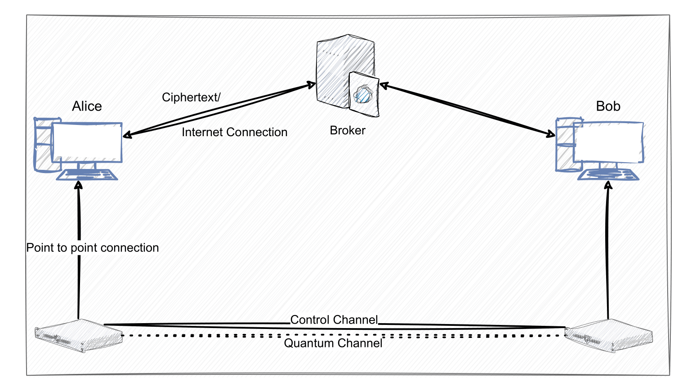

# Q-BITS: Quantum-Based Information Transfer System
## Unconditionally-Secure File Transfer Application

    
    

This application implements an unconditionally secure file transfer protocol enhanced by QKD.

This application has been developed by the Quantum Team @ UPB, and is provided to everyone for fair usage according to the License. This provided version of the application only implements the communication protocol between two parties, who can both either be a sender or receiver of files.

### Features:

- Secure file transfer using One-Time Pad (OTP) encryption enhanced by QKD.
- Straighforward, user-friendly interface.

### Requirements:

- Python 3
- `tkinter` library for GUI elements
- `numpy` library for numerical computations
- `json` library for parsing JSON responses
- `pillow` library for image processing (used for the application icon)

To install all the required dependencies use

`pip3 install tkinter numpy json pillow`

- A point-to-point connection to a QKD device, and a way to get keys that can interface with QKGTTR module.

### Running the application:

Run the script from the command line, specifying either "Alice" or "Bob" as the first argument depending on which party you want to run the application for: 

`python3 qotp.py Alice`

### How it works:

The application prompts the user to choose between sending or receiving a file.
    
If sending, the user selects a file to transfer. The application retrieves encryption keys from the server and encrypts the file using a One-Time Pad before sending it to the receiver through the broker server.
    
If receiving, the application listens for incoming transmissions. If not actively sending a file, the application is passively listening for transmissions. When a file is sent to the user, a prompt to confirm the transmission appears. If accepted, the application retrieves decryption keys from the server and decrypts the received data before saving it as a file.
    
Below you can find a diagram of how the unconditionally secure transmissions work.

    

As can be seen in the protocol diagram, Alice and Bob need to have a point-to-point connection to the QKD systems in order to preserve the unconditional security property of this protocol. Considering the situation where Bob is the sender and Alice the receiver, Bob would need to request keys from their QKD equipment, and then transmit the ciphertext and key ids over a public channel towards the broker, which then forwards the information to Alice. Afterwards, Alice will request the actual keys from their QKD equipment using the key ids provided by Bob, and will then proceed to decrypt the ciphertext. These steps continue until the original message of Bob has been entirely sent. 

The existence of the broker comes as a solution for possible security considerations that neither Alice and Bob may have public IPs. Therefore, an intermediary with a known public IP is needed to broker the information transfer. Since the broker only passes the ciphertext and key ids, the security of this scheme is not compromised.

2024 Quantum Team @ UPB

This work has been developed within RoNaQCI, part of EuroQCI, DIGITAL-2021-QCI-01-DEPLOY-NATIONAL, 101091562.

