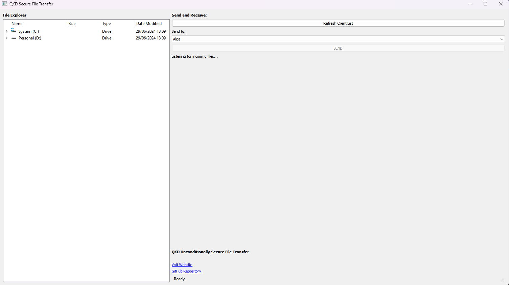

# Q-BITS: Quantum-Based Information Transfer System
## Unconditionally-Secure File Transfer Application

    
    

### Description

This application implements an unconditionally secure file transfer protocol enhanced by QKD.

This application has been developed by the Quantum Team @ UPB, and is provided to everyone for fair usage according to the License. This provided version of the application only implements the communication protocol between two parties, who can both either be a sender or receiver of files.

### Features

- Secure file transfer using One-Time Pad (OTP) encryption enhanced by QKD.
- Straighforward, user-friendly interface.

### Requirements

- A point-to-point connection to a QKD device that can be used by the [QKDGKT](https://github.com/QuantumUPB/QKD-Infra-GetKey) module.
- A server with a public IP on which to run the broker, and with `python3` installed.

### Starting the broker

On a server with a known public IP, run the `broker.py` script.

`python3 broker.py`

By default, it will use the port `12345`, so make sure that the firewall rules of your machine will allow connections on that port.

### Starting the application

You'll need to download the release specific to your operating system. After unzipping the archive, you'll have to add the following files to your folder:
- Cert: Your personal signed SSL certificate
- Key: Your personal key
- CACert: The certificate associated to the CA

Afterwards, fill in the `config.json` file in accordance to the sample provided `config_sample.json`.

Now, you can run the application directly, either through the CLI or the GUI of your operating system.

e.g. running through the Windows CLI:
`./QKD-FileTransfer.exe`

Next, you'll have to provide:

- The IP of your running broker.
- The open port of that machine.
- The QKD device from which you take keys.
- Your name with which others can identify you.

### How it works

The default mode of the application is to listen for incoming files. Any number of clients can connect to the broker, and may send files between themselves.

In the leftmost part of the application you can find a file explorer. In the center-right of the application, below the `Refresh Client List` button, you can select the destination of your transmission.

After selecting a file and a receiver, you can press the `SEND` button to begin the transmission.

### Security considerations

- The machines which run this application should have a point to point connection to the QKD devices in order to maintain the unconditional security of this protocol.

- The broker machine should only allow connections from a secure subnet in which the clients are situated.

2024 Quantum Team @ UPB

This work has been developed within RoNaQCI, part of EuroQCI, DIGITAL-2021-QCI-01-DEPLOY-NATIONAL, 101091562.

